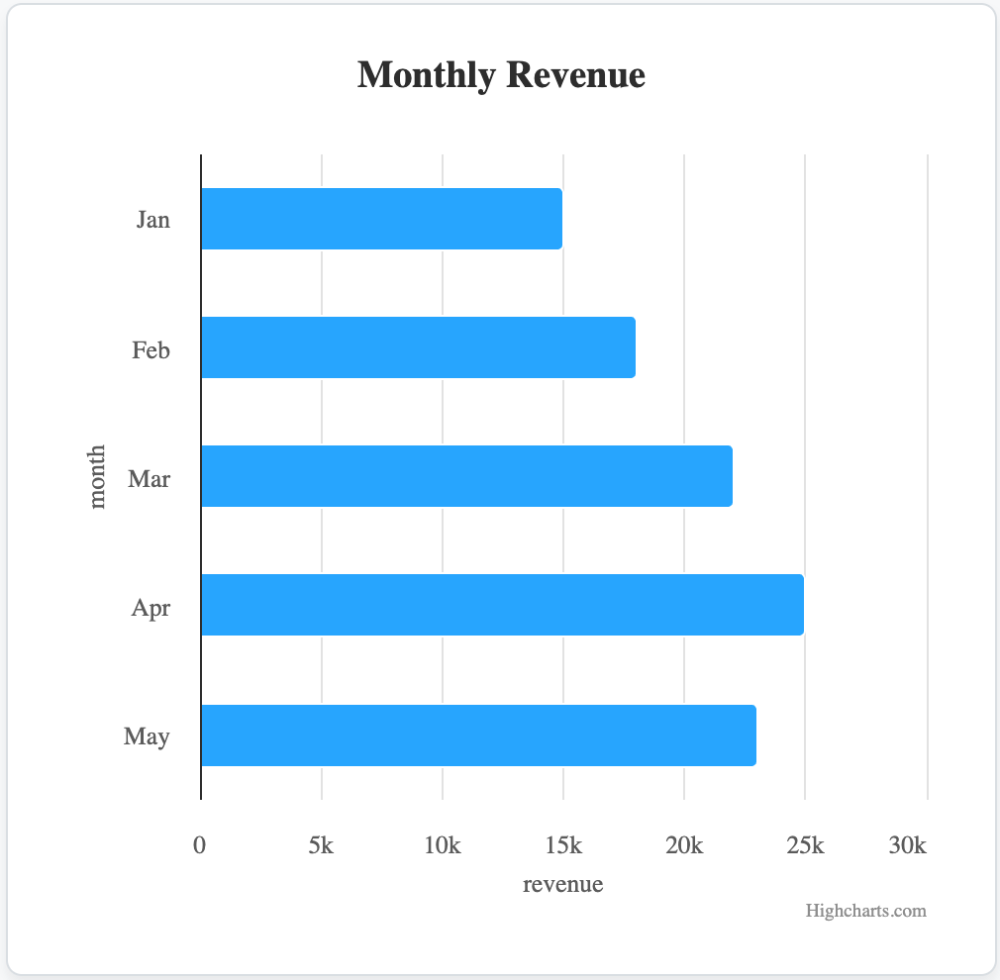

# One-viz: AI-Powered, Framework-Agnostic Data Visualization

[](https://www.npmjs.com/package/one-viz)
[](https://opensource.org/licenses/MIT)
[](CONTRIBUTING.md)
[](https://josephaxisa.github.io/one-viz/)

**A next-generation data visualization library designed to democratize data insights. One-viz delivers AI-powered, interactive, and framework-agnostic web components that work seamlessly in any modern web application.**

---

## Overview

One-viz bridges the critical gap between complex data analytics and practical, actionable business intelligence. In an era where data drives decision-making, One-viz provides an essential toolkit for developers and organizations to build powerful, intuitive, and interactive visualizations with minimal effort.

By leveraging modern web components, it breaks free from the limitations of traditional JavaScript frameworks, offering a truly universal solution that is both powerful and exceptionally easy to integrate.

## The One-viz Advantage (Why This Matters)

This library is not just another charting tool; it represents a significant step forward in the field of data visualization and web development.

*   **✨ Universal Compatibility (Framework-Agnostic):** One-viz is built on native web standards, making it compatible with **React, Angular, Vue, Svelte, or no framework at all**. This eliminates vendor lock-in and dramatically reduces the integration burden for engineering teams, fostering a more open and interoperable web ecosystem.

*   **🧠 AI-Powered & Future-Proof:** The architecture is designed for the future of analytics. It lays the groundwork for **conversational data exploration**, where users can query complex datasets using natural language. This positions One-viz at the forefront of the shift towards generative AI in business intelligence.

*   **🚀 Zero-Configuration & Effortless Use:** By automatically managing dependencies from a CDN and providing a simple, declarative HTML-based API, One-viz significantly lowers the barrier to entry for creating sophisticated data visualizations. This empowers developers of all skill levels to deliver high-impact data stories.

## Visual Showcase

Here are a few examples of the charts you can create with One-viz.

| Bar Chart                                       | Pie Chart                                     |
| :---------------------------------------------: | :-------------------------------------------: |
|  |  |

---

## Getting Started

1.  **Install from npm:**
    ```bash
    npm install one-viz
    ```

2.  **Import the components:**
    ```javascript
    // Import all components at once
    import 'one-viz';

    // Or import individually
    import 'one-viz/dist/components/BarChart/OneVizBarChart';
    ```

3.  **Use in your HTML:**
    ```html
    <oneviz-barchart
      title="Monthly Revenue"
      x-field="month"
      y-field="revenue"
    ></oneviz-barchart>

    <script>
      const chart = document.querySelector('oneviz-barchart');
      chart.data = [
        { "month": "Jan", "revenue": 15000 },
        { "month": "Feb", "revenue": 18000 },
        { "month": "Mar", "revenue": 22000 }
      ];
    </script>
    ```

For framework-specific examples (like React), please see our [CONTRIBUTING.md](./CONTRIBUTING.md).

---

## API Reference

All chart components inherit from a base class and share a common set of properties, attributes, and theming variables.

### Common Properties & Attributes

| Property | Attribute | Type    | Description                                             |
| :------- | :-------- | :------ | :------------------------------------------------------ |
| `title`  | `title`   | String  | The main title displayed above the chart.               |
| `data`   | N/A       | Array   | The array of data objects to plot.                      |
| `xField` | `x-field` | String  | The field in the data objects for the x-axis/categories. |
| `yField` | `y-field` | String  | The field in the data objects for the y-axis/values.    |

### Common Theming (CSS Custom Properties)

You can style all charts by setting these CSS variables on the component or a parent element.

| Variable                      | Description                                    | Default   |
| :---------------------------- | :--------------------------------------------- | :-------- |
| `--oneviz-background-color`   | The background color of the chart.             | `#ffffff` |
| `--oneviz-title-color`        | The color of the chart's title text.           | `#333333` |
| `--oneviz-axis-label-color`   | The color of the axis labels and legend text.  | `#666666` |
| `--oneviz-font-family`        | The font family used throughout the chart.     | `sans-serif`|

---

### Component-Specific APIs

#### `<oneviz-barchart>`

*   **Event:** `oneviz-bar-click`
    *   Fired when a bar is clicked.
    *   `event.detail`: `{ category: string, value: number, originalEvent: object }`

#### `<oneviz-piechart>`

*   **Event:** `oneviz-pie-click`
    *   Fired when a pie slice is clicked.
    *   `event.detail`: `{ name: string, value: number, originalEvent: object }`

#### `<oneviz-linechart>`

*   **Event:** `oneviz-line-click`
    *   Fired when a point on the line is clicked.
    *   `event.detail`: `{ category: string, value: number, originalEvent: object }`
*   **Theming:**
    *   `--oneviz-line-color`: The color of the line. (Default: `#007bff`)

#### `<oneviz-scatterchart>`

*   **Event:** `oneviz-scatter-click`
    *   Fired when a point is clicked.
    *   `event.detail`: `{ x: number, y: number, originalEvent: object }`

---

## Contributing

We welcome contributions! Please see our [CONTRIBUTING.md](./CONTRIBUTING.md) for guidelines on how to set up the project, run the demo, and submit your work.

## License

One-viz is released under the MIT License. See [LICENSE](./LICENSE) for details.